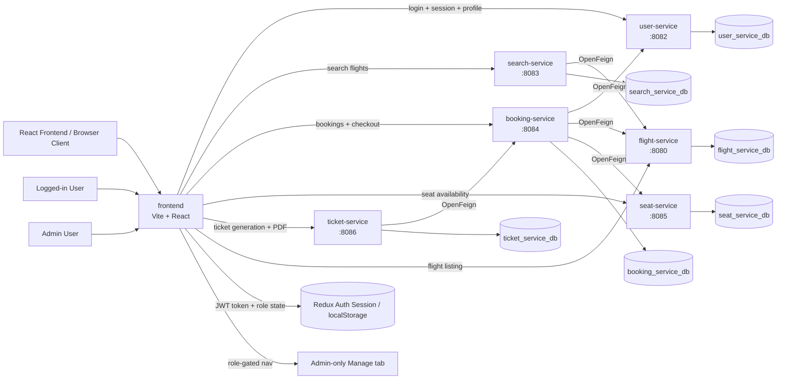

# Flight Booking
 
## Overview
 
The Flight Booking System is designed as a set of independent Spring Boot microservices. Each service owns its own database, business logic, REST APIs, and internal package structure. Services communicate over HTTP using OpenFeign where cross-service coordination is required.
 
This architecture keeps the system modular, easier to scale, and safer to evolve because each service can be developed and deployed independently.
 
## Microservice Interaction Diagram
 

 
## Request Flow
 
At a high level, the system follows a client-to-service REST architecture, with the React frontend now acting as the main user-facing entry point.
 
1. The React frontend loads the app shell and checks the saved Redux/auth session in local storage.
2. If a user is logged in, the frontend hydrates the current session and renders the role-aware navigation tabs.
3. Non-admin users see Book flights and My bookings, while admin users see Manage services only.
4. For authenticated requests, the frontend calls a microservice REST endpoint and includes the JWT token in the request header.
5. The controller receives the HTTP request and performs request binding and validation.
6. The service layer applies business rules.
7. If needed, the service calls another microservice through OpenFeign.
8. The repository layer persists or retrieves data from the service-owned MySQL database.
9. The service maps entities to DTOs and returns the response.
10. The frontend updates the page state, refreshes role-specific data, and re-renders the booking or management experience.
11. Global exception handling converts failures into consistent API error responses.
 
### Auth and identity flow
 
The login and registration flow now returns a session object that includes the authenticated user’s core identity information, including the first and last name fields needed by the passenger selector in the booking page.
 
This means the frontend can show a logged-in user’s real name in the booking experience instead of rendering an empty or undefined passenger label.
 
## Booking Flow
 
The booking flow is coordinated mainly by `booking-service`.
 
### Booking creation flow
 
1. Client sends `POST /bookings` to `booking-service`.
2. `booking-service` validates the request.
3. `booking-service` verifies the user by calling `user-service`.
4. `booking-service` verifies the flight by calling `flight-service`.
5. `booking-service` verifies the seat by calling `seat-service`.
6. `booking-service` checks that the seat belongs to the selected flight.
7. `booking-service` checks that the seat is available.
8. `booking-service` reserves the seat through `seat-service`.
9. `booking-service` generates a booking reference and stores the booking in `booking_service_db`.
10. If persistence fails after reservation, `booking-service` attempts to release the seat to avoid leaving the seat locked.
 
### Booking update flow
 
1. Client sends `PUT /bookings/{id}`.
2. `booking-service` validates the new user, flight, and seat.
3. If the seat changes, the new seat is reserved first.
4. The booking is updated in the database.
5. The old seat is released if a different seat was selected.
 
### Booking deletion flow
 
1. Client sends `DELETE /bookings/{id}`.
2. `booking-service` deletes the booking record.
3. `booking-service` releases the reserved seat through `seat-service`.
 
## Search Flow
 
The search flow is handled by `search-service`.
 
1. Client sends `GET /search` with query parameters such as:
   - `source`
   - `destination`
   - `departureDate`
   - `returnDate`
   - `numberOfPassengers`
   - `travelClass`
2. `search-service` validates the request.
3. `search-service` stores the search request in `search_service_db` as `SearchHistory`.
4. `search-service` calls `flight-service` using OpenFeign.
5. `search-service` filters the returned flights based on:
   - source
   - destination
   - departure date
   - available seats
6. Matching flights are returned as `SearchResponseDto`.
 
### Current search limitation
 
`flight-service` currently does not expose `travelClass` or return-trip-specific search data, so `search-service` stores those request values but cannot yet filter on them at the flight data level. That part can be enhanced later without changing the service boundaries.
 
## Ticket Flow
 
The ticket flow is handled by `ticket-service`.
 
1. Client sends `POST /tickets` or `POST /tickets/generate`.
2. `ticket-service` validates the request.
3. `ticket-service` verifies the booking by calling `booking-service`.
4. If the booking exists and is not cancelled, `ticket-service` generates a unique ticket number.
5. Ticket data is stored in `ticket_service_db`.
6. Tickets can later be fetched by ID, fetched by booking ID, updated, cancelled, or deleted.
 
## Database Architecture
 
The system uses the database-per-service pattern.
 
| Service | Database | Purpose |
|---|---|---|
| `flight-service` | `flight_service_db` | Stores flight master data |
| `user-service` | `user_service_db` | Stores passenger/user profile data |
| `search-service` | `search_service_db` | Stores search history |
| `booking-service` | `booking_service_db` | Stores booking transactions |
| `seat-service` | `seat_service_db` | Stores seat inventory and reservation status |
| `ticket-service` | `ticket_service_db` | Stores generated tickets |
 
### Database characteristics
 
- Every microservice owns its own schema and tables.
- Services do not directly access another service's database.
- Cross-service coordination happens only through REST + OpenFeign.
- JPA/Hibernate is used with `ddl-auto=update`.
- MySQL is used as the persistence layer across all services.
